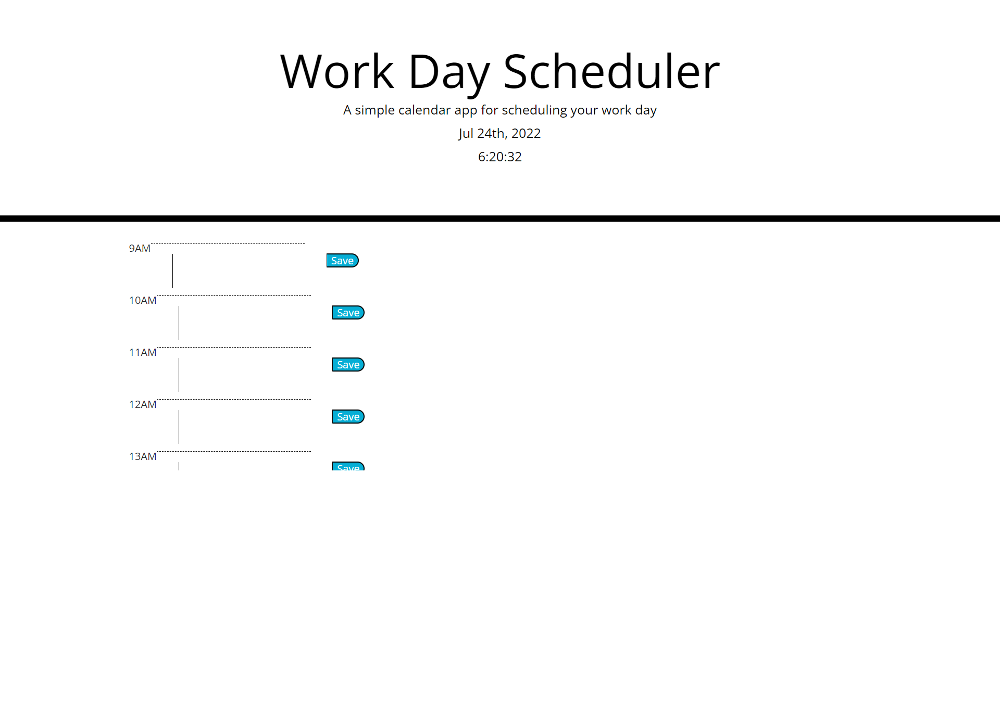

# Work-Day-Scheduler
A calendar app and workday scheduler

## Description

This is a workday schedule and calendar app. Enter tasks in the appropriate timeslot and click save. It will display to the user whether each slot is in the past, present, or future. It saves the data in local storage for retrieval later.

## Technologies Used

-HTML
-CSS
-Javescript

## Installation

1. Clone this repository to your computer's desktop.
2. Navigate to the top level directory.
3. Open the index.html file in a browser.

## Usage

## Link to Deployed Application and Repo

https://holgateb.github.io/work-day-scheduler/

https://github.com/holgateb